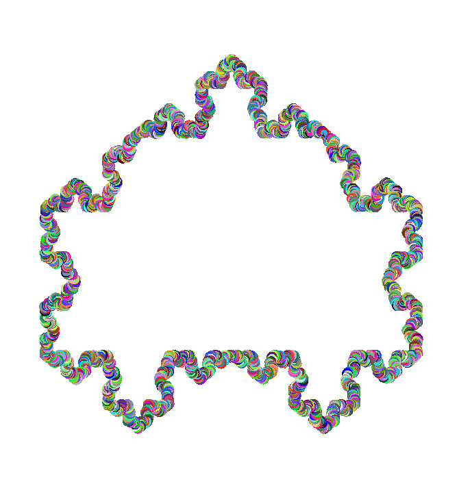

# LSystem Exploration
#### Author: Jared Berry



This project was associated with ME 302: Artificial Life at Northwestern University.

#### Project Description
The goal of this project was to explore string-based LSystem generation, with both 2D and 3D rendering. To create a new rule config,
look at the example configs in config/. Make sure to specify the config name in `main.py`.

To run, use the command:
```
python -m src.main
```

#### Code Structure
- lsystem.py
    * Contains LSystem class for string parsing and evolution.
- main.py
    * Main script for running LSystem demos. Change LSystem config here.
- render2d.py
    * 2D renderer for LSystems using turtle graphics.
- render3d.py
    * 3D renderer for LSystems using turtle graphics.
- ruleset.py
    * Rule and ruleset containment for 2D and 3D LSystems.
